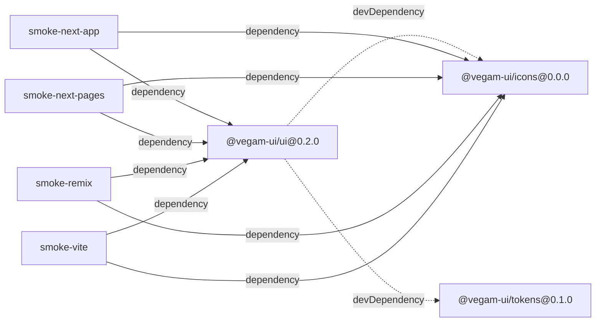
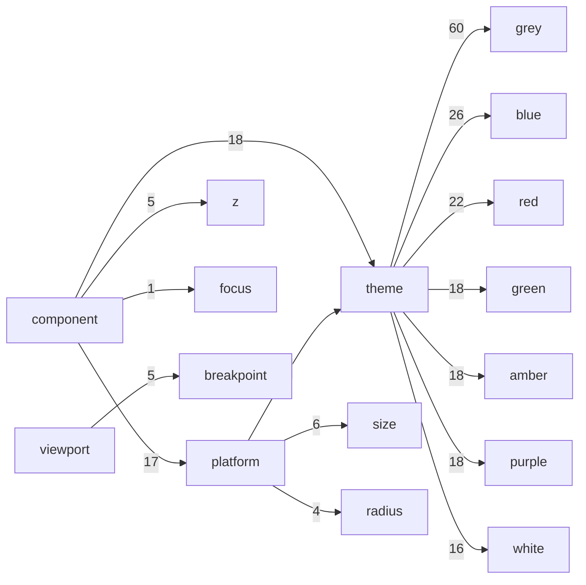

# Architecture — relationship graphs

<!-- GENERATED BY scripts/graphify.mjs — DO NOT EDIT. Run `pnpm graph`. -->

Derived from source, not hand-drawn: package manifests, the import statements
under `packages/ui/src`, and the reference values in `tokens.json`. Regenerate
with `pnpm graph`; `pnpm graph:check` fails when this file drifts.

## Workspace

How the packages and smoke apps depend on each other. Solid = dependency,
dotted = devDependency, thick = peerDependency.

The smoke apps depend on `@vegam-ui/ui` as `workspace:*` only so pnpm resolves
them for local development; the release gate installs the **packed tarball**
instead, outside the workspace.

`@vegam-ui/tokens` is a devDependency of `@vegam-ui/ui`, never a runtime
dependency: its CSS is inlined into `dist/index.css` at build time, so the
published package has zero runtime dependencies.

## Modules inside @vegam-ui/ui

Each component folder (`.tsx` + `.types.ts` + `index.ts`) is collapsed to one
node. Solid edges are runtime imports; dotted `type` edges are erased at
compile time and carry no runtime coupling.

```mermaid
graph TD
  subgraph layer_public_entry["public entry"]
    index__barrel_["index (barrel)"]
  end
  subgraph layer_components["components"]
    Accordion["Accordion"]
    Avatar["Avatar"]
    Badge["Badge"]
    Banner["Banner"]
    Blanket["Blanket"]
    Box["Box"]
    Breadcrumbs["Breadcrumbs"]
    Button["Button"]
    Card["Card"]
    Checkbox["Checkbox"]
    Chip["Chip"]
    Container["Container"]
    Divider["Divider"]
    Drawer["Drawer"]
    Field["Field"]
    Flex["Flex"]
    Grid["Grid"]
    IconButton["IconButton"]
    Input["Input"]
    Link["Link"]
    Menu["Menu"]
    Modal["Modal"]
    Pagination["Pagination"]
    Popover["Popover"]
    Progress["Progress"]
    Radio["Radio"]
    Select["Select"]
    Skeleton["Skeleton"]
    Slider["Slider"]
    Spinner["Spinner"]
    Stack["Stack"]
    Switch["Switch"]
    Table["Table"]
    Tabs["Tabs"]
    Text["Text"]
    Textarea["Textarea"]
    Toast["Toast"]
    Tooltip["Tooltip"]
  end
  subgraph layer_theme["theme"]
    defaultProps["defaultProps"]
    theme["theme"]
    ThemeProvider["ThemeProvider"]
  end
  subgraph layer_hooks["hooks"]
    useAnchoredPosition["useAnchoredPosition"]
    useBreakpoint["useBreakpoint"]
    useControlled["useControlled"]
    useDismiss["useDismiss"]
    useIsomorphicLayoutEffect["useIsomorphicLayoutEffect"]
    useMediaQuery["useMediaQuery"]
    useRovingFocus["useRovingFocus"]
    useThemedPortal["useThemedPortal"]
    useTransitionState["useTransitionState"]
    useTriggerRef["useTriggerRef"]
  end
  subgraph layer_utils__framework_free_["utils (framework-free)"]
    breakpoints["breakpoints"]
    cx["cx"]
    dismiss["dismiss"]
    drag["drag"]
    focusTrap["focusTrap"]
    listNavigation["listNavigation"]
    positioning["positioning"]
    responsive["responsive"]
    scrollLock["scrollLock"]
    tokenScales["tokenScales"]
  end
  Accordion --> cx
  Accordion --> useControlled
  Avatar --> cx
  Avatar --> defaultProps
  Badge --> cx
  Badge --> defaultProps
  Banner --> cx
  Banner --> defaultProps
  Blanket --> cx
  Box --> breakpoints
  Box --> cx
  Box --> responsive
  Box --> tokenScales
  Breadcrumbs --> cx
  Breadcrumbs --> useControlled
  Button --> cx
  Button --> defaultProps
  Card --> cx
  Card --> defaultProps
  Checkbox --> cx
  Checkbox --> defaultProps
  Checkbox --> Field
  Checkbox --> useIsomorphicLayoutEffect
  Chip --> cx
  Chip --> defaultProps
  Container --> cx
  Container --> defaultProps
  defaultProps -.->|type| Avatar
  defaultProps -.->|type| Badge
  defaultProps -.->|type| Banner
  defaultProps -.->|type| Button
  defaultProps -.->|type| Card
  defaultProps -.->|type| Checkbox
  defaultProps -.->|type| Chip
  defaultProps -.->|type| Container
  defaultProps -.->|type| Divider
  defaultProps -.->|type| Drawer
  defaultProps -.->|type| Flex
  defaultProps -.->|type| Grid
  defaultProps -.->|type| IconButton
  defaultProps -.->|type| Input
  defaultProps -.->|type| Link
  defaultProps -.->|type| Modal
  defaultProps -.->|type| Progress
  defaultProps -.->|type| Radio
  defaultProps -.->|type| Select
  defaultProps -.->|type| Skeleton
  defaultProps -.->|type| Spinner
  defaultProps -.->|type| Stack
  defaultProps -.->|type| Tabs
  defaultProps -.->|type| Text
  defaultProps -.->|type| Textarea
  Divider --> cx
  Divider --> defaultProps
  Divider -.->|type| tokenScales
  Drawer --> Blanket
  Drawer --> cx
  Drawer --> defaultProps
  Drawer --> focusTrap
  Drawer --> scrollLock
  Drawer --> useThemedPortal
  Drawer --> useTransitionState
  Field --> cx
  Flex --> cx
  Flex --> defaultProps
  Flex --> responsive
  Flex --> tokenScales
  Grid --> cx
  Grid --> defaultProps
  Grid --> responsive
  Grid --> tokenScales
  IconButton --> Button
  IconButton --> cx
  IconButton --> defaultProps
  index__barrel_ --> Accordion
  index__barrel_ --> Avatar
  index__barrel_ --> Badge
  index__barrel_ --> Banner
  index__barrel_ --> Blanket
  index__barrel_ --> Box
  index__barrel_ --> Breadcrumbs
  index__barrel_ --> breakpoints
  index__barrel_ --> Button
  index__barrel_ --> Card
  index__barrel_ --> Checkbox
  index__barrel_ --> Chip
  index__barrel_ --> Container
  index__barrel_ --> cx
  index__barrel_ --> Divider
  index__barrel_ --> Drawer
  index__barrel_ --> Field
  index__barrel_ --> Flex
  index__barrel_ --> Grid
  index__barrel_ --> IconButton
  index__barrel_ --> Input
  index__barrel_ --> Link
  index__barrel_ --> Menu
  index__barrel_ --> Modal
  index__barrel_ --> Pagination
  index__barrel_ --> Popover
  index__barrel_ -.->|type| positioning
  index__barrel_ --> Progress
  index__barrel_ --> Radio
  index__barrel_ -.->|type| responsive
  index__barrel_ --> Select
  index__barrel_ --> Skeleton
  index__barrel_ --> Slider
  index__barrel_ --> Spinner
  index__barrel_ --> Stack
  index__barrel_ --> Switch
  index__barrel_ --> Table
  index__barrel_ --> Tabs
  index__barrel_ --> Text
  index__barrel_ --> Textarea
  index__barrel_ --> theme
  index__barrel_ --> Toast
  index__barrel_ --> tokenScales
  index__barrel_ --> Tooltip
  index__barrel_ --> useBreakpoint
  index__barrel_ --> useControlled
  index__barrel_ --> useDismiss
  index__barrel_ --> useIsomorphicLayoutEffect
  index__barrel_ --> useMediaQuery
  index__barrel_ --> useTransitionState
  Input --> cx
  Input --> defaultProps
  Input --> Field
  Link --> cx
  Link --> defaultProps
  Menu --> cx
  Menu --> listNavigation
  Menu -.->|type| positioning
  Menu --> useAnchoredPosition
  Menu --> useControlled
  Menu --> useDismiss
  Menu --> useRovingFocus
  Menu --> useThemedPortal
  Menu --> useTransitionState
  Menu --> useTriggerRef
  Modal --> Blanket
  Modal --> cx
  Modal --> defaultProps
  Modal --> focusTrap
  Modal --> scrollLock
  Modal --> useIsomorphicLayoutEffect
  Pagination --> Button
  Pagination --> cx
  Pagination --> IconButton
  Pagination --> useControlled
  Popover --> cx
  Popover --> focusTrap
  Popover -.->|type| positioning
  Popover --> useAnchoredPosition
  Popover --> useControlled
  Popover --> useDismiss
  Popover --> useThemedPortal
  Popover --> useTransitionState
  Popover --> useTriggerRef
  Progress --> cx
  Progress --> defaultProps
  Radio --> cx
  Radio --> defaultProps
  Radio --> Field
  Radio --> useControlled
  responsive --> breakpoints
  Select --> cx
  Select --> defaultProps
  Select --> Field
  Select --> listNavigation
  Select --> positioning
  Select --> useControlled
  Select --> useDismiss
  Select --> useIsomorphicLayoutEffect
  Skeleton --> cx
  Skeleton --> defaultProps
  Skeleton -.->|type| tokenScales
  Slider --> cx
  Slider --> drag
  Slider --> Field
  Slider --> useControlled
  Spinner --> cx
  Spinner --> defaultProps
  Stack --> cx
  Stack --> defaultProps
  Switch --> cx
  Switch --> Field
  Table --> cx
  Tabs --> cx
  Tabs --> defaultProps
  Tabs --> listNavigation
  Tabs --> useControlled
  Tabs --> useRovingFocus
  Text --> cx
  Text --> defaultProps
  Textarea --> cx
  Textarea --> defaultProps
  Textarea --> Field
  Textarea --> useIsomorphicLayoutEffect
  theme --> defaultProps
  theme --> ThemeProvider
  ThemeProvider --> cx
  ThemeProvider --> defaultProps
  Toast --> cx
  Toast --> useTransitionState
  Tooltip --> cx
  Tooltip -.->|type| positioning
  Tooltip --> useAnchoredPosition
  Tooltip --> useControlled
  Tooltip --> useThemedPortal
  Tooltip --> useTransitionState
  Tooltip --> useTriggerRef
  useAnchoredPosition --> positioning
  useAnchoredPosition --> useIsomorphicLayoutEffect
  useBreakpoint --> breakpoints
  useDismiss --> dismiss
  useRovingFocus --> listNavigation
  useRovingFocus --> useIsomorphicLayoutEffect
  useThemedPortal --> useIsomorphicLayoutEffect
```

What to read off this graph:

- **`utils` is a sink.** No node in `utils` points back into `components`,
  `hooks`, or `theme`, so behaviour logic stays framework-free — the property
  CLAUDE.md requires and the reason a non-React target stays cheap.
- **`hooks` sit between.** Hook modules may import `utils`, never the
  reverse; `theme` and `components` may import both. The layering
  `utils ← hooks ← (theme, components) ← barrel` stays acyclic.
- **The one apparent cycle is type-only.** `defaultProps` imports each
  component's props type to key `ThemeComponentDefaults`, while every component
  imports `useComponentDefaults` at runtime. The dotted direction disappears
  after compilation, so there is no runtime cycle and no bundling hazard.
- **Everything is reachable from `index (barrel)`.** An unreachable node would
  be dead code that still ships.

## Token layers

Which semantic groups reference which primitive palettes. Edge labels count the
references. Primitives are raw values; semantic tokens are what components use.

263 primitive tokens, 240 semantic tokens
(including the `dark.*` overrides, which remap the same custom-property names
under `[data-theme="dark"]`).

## Facts

- **Public exports:** 100 values, 140 types
- **Modules:** 62 (38 components, 3 theme, 10 hooks, 10 utils)
- **`'use client'` files:** 50 — Accordion, Avatar, Badge, Banner, Blanket, Box, Breadcrumbs, Button, Card, Checkbox, Chip, Container, defaultProps, Divider, Drawer, Field, Flex, Grid, IconButton, Input, Link, Menu, Modal, Pagination, Popover, Progress, Radio, Select, Skeleton, Slider, Spinner, Stack, Switch, Table, Tabs, Text, Textarea, ThemeProvider, Toast, Tooltip, useAnchoredPosition, useBreakpoint, useControlled, useDismiss, useIsomorphicLayoutEffect, useMediaQuery, useRovingFocus, useThemedPortal, useTransitionState, useTriggerRef
- **Modules with colocated CSS:** 40 — Accordion, Avatar, Badge, Banner, Blanket, Box, Breadcrumbs, Button, Card, Checkbox, Chip, Container, Divider, Drawer, Field, Flex, Grid, IconButton, index (barrel), Input, Link, Menu, Modal, Pagination, Popover, Progress, Radio, Select, Skeleton, Slider, Spinner, Stack, Switch, Table, Tabs, Text, Textarea, ThemeProvider, Toast, Tooltip
- **External imports:** react, react-dom

### Values

`Accordion` · `Avatar` · `Badge` · `Banner` · `Blanket` · `Box` · `Breadcrumbs` · `Button` · `Card` · `Checkbox` · `Chip` · `Container` · `Divider` · `Drawer` · `Field` · `FieldContext` · `Flex` · `Grid` · `IconButton` · `Input` · `Link` · `Menu` · `Modal` · `Pagination` · `Popover` · `Progress` · `Radio` · `RadioGroup` · `Select` · `Skeleton` · `Slider` · `Spinner` · `Stack` · `Switch` · `Table` · `Tabs` · `Text` · `Textarea` · `ThemeProvider` · `ToastProvider` · `Tooltip` · `accordionClasses` · `avatarClasses` · `badgeClasses` · `bannerClasses` · `blanketClasses` · `borderColorKeys` · `boxClasses` · `breadcrumbsClasses` · `breakpointOrder` · `breakpointWidths` · `buttonClasses` · `cardClasses` · `checkboxClasses` · `chipClasses` · `containerClasses` · `cx` · `dividerClasses` · `dividerTones` · `drawerClasses` · `elevationSteps` · `fieldClasses` · `flexClasses` · `gridClasses` · `iconButtonClasses` · `inputClasses` · `linkClasses` · `menuClasses` · `modalClasses` · `paginationClasses` · `paginationRange` · `popoverClasses` · `progressClasses` · `radioClasses` · `radioGroupClasses` · `radiusSteps` · `selectClasses` · `skeletonClasses` · `sliderClasses` · `spaceSteps` · `spinnerClasses` · `stackClasses` · `surfaceKeys` · `switchClasses` · `tableClasses` · `tabsClasses` · `textClasses` · `textareaClasses` · `themeClasses` · `toastClasses` · `tooltipClasses` · `useBreakpoint` · `useComponentDefaults` · `useControlled` · `useDismiss` · `useField` · `useIsomorphicLayoutEffect` · `useMediaQuery` · `useToast` · `useTransitionState`

### Types

`AccordionItem` · `AccordionProps` · `AccordionSlotProps` · `Align` · `AvatarProps` · `AvatarShape` · `AvatarSize` · `BadgeProps` · `BadgeTone` · `BannerIntent` · `BannerProps` · `BannerSlotProps` · `BlanketProps` · `BorderColorKey` · `BoxAs` · `BoxProps` · `BreadcrumbsItem` · `BreadcrumbsLinkRenderProps` · `BreadcrumbsProps` · `BreadcrumbsSlotProps` · `BreadcrumbsSlots` · `Breakpoint` · `ButtonProps` · `ButtonSize` · `ButtonVariant` · `CardPadding` · `CardProps` · `CardVariant` · `CheckboxProps` · `CheckboxSize` · `ChipProps` · `ChipSize` · `ChipSlotProps` · `ChipTone` · `ColorScheme` · `ContainerAs` · `ContainerProps` · `ContainerSize` · `DividerOrientation` · `DividerProps` · `DividerTone` · `DrawerPlacement` · `DrawerProps` · `DrawerSize` · `DrawerSlotProps` · `ElevationStep` · `FieldContextValue` · `FieldProps` · `FieldSlotProps` · `FlexAlign` · `FlexDirection` · `FlexJustify` · `FlexProps` · `FlexWrap` · `GridProps` · `IconButtonName` · `IconButtonProps` · `InputProps` · `InputSize` · `LinkAnchorProps` · `LinkProps` · `LinkSlots` · `LinkVariant` · `MenuItem` · `MenuItemDomProps` · `MenuItemRenderProps` · `MenuProps` · `MenuSlotProps` · `MenuSlots` · `ModalAppearance` · `ModalProps` · `ModalSize` · `ModalSlotProps` · `PaginationProps` · `PaginationSlotProps` · `PopoverProps` · `PopoverSlotProps` · `ProgressProps` · `ProgressSize` · `ProgressTone` · `RadioGroupProps` · `RadioProps` · `RadioSize` · `RadiusStep` · `ResponsiveObject` · `ResponsiveValue` · `SelectOption` · `SelectOptionRenderProps` · `SelectProps` · `SelectSize` · `SelectSlotProps` · `SelectSlots` · `Side` · `SkeletonProps` · `SkeletonVariant` · `SliderProps` · `SortDirection` · `SpaceStep` · `SpinnerProps` · `SpinnerSize` · `StackAlign` · `StackDirection` · `StackGap` · `StackJustify` · `StackProps` · `SurfaceKey` · `SwitchProps` · `TabItem` · `TableAlign` · `TableCellRenderProps` · `TableColumn` · `TableHeaderCellRenderProps` · `TableProps` · `TableSlotProps` · `TableSlots` · `TableSort` · `TabsActivation` · `TabsOrientation` · `TabsProps` · `TabsSlotProps` · `TextAs` · `TextProps` · `TextSize` · `TextTone` · `TextWeight` · `TextareaProps` · `TextareaSize` · `ThemeComponentDefaults` · `ThemeProviderProps` · `ToastApi` · `ToastIntent` · `ToastOptions` · `ToastPlacement` · `ToastProviderProps` · `ToastRecord` · `TooltipProps` · `TooltipSlotProps` · `TransitionState` · `UseDismissOptions` · `UseTransitionStateResult`
