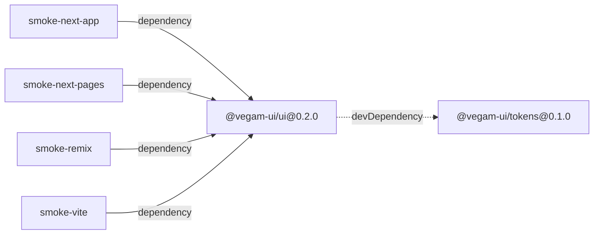
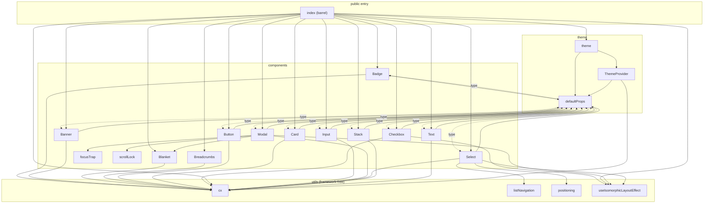

# Architecture — relationship graphs

<!-- GENERATED BY scripts/graphify.mjs — DO NOT EDIT. Run `pnpm graph`. -->

Derived from source, not hand-drawn: package manifests, the import statements
under `packages/ui/src`, and the reference values in `tokens.json`. Regenerate
with `pnpm graph`; `pnpm graph:check` fails when this file drifts.

## Workspace

How the packages and smoke apps depend on each other. Solid = dependency,
dotted = devDependency, thick = peerDependency.

The smoke apps depend on `@vegam-ui/ui` as `workspace:*` only so pnpm resolves
them for local development; the release gate installs the **packed tarball**
instead, outside the workspace.

`@vegam-ui/tokens` is a devDependency of `@vegam-ui/ui`, never a runtime
dependency: its CSS is inlined into `dist/index.css` at build time, so the
published package has zero runtime dependencies.

## Modules inside @vegam-ui/ui

Each component folder (`.tsx` + `.types.ts` + `index.ts`) is collapsed to one
node. Solid edges are runtime imports; dotted `type` edges are erased at
compile time and carry no runtime coupling.

What to read off this graph:

- **`utils` is a sink.** No node in `utils` points back into `components` or
  `theme`, so behaviour logic stays framework-free — the property CLAUDE.md
  requires and the reason a non-React target stays cheap.
- **The one apparent cycle is type-only.** `defaultProps` imports each
  component's props type to key `ThemeComponentDefaults`, while every component
  imports `useComponentDefaults` at runtime. The dotted direction disappears
  after compilation, so there is no runtime cycle and no bundling hazard.
- **Everything is reachable from `index (barrel)`.** An unreachable node would
  be dead code that still ships.

## Token layers

Which semantic groups reference which primitive palettes. Edge labels count the
references. Primitives are raw values; semantic tokens are what components use.

```mermaid
graph LR
  dark_action["dark.action"] -->|6| blue["blue"]
  dark_action["dark.action"] -->|6| white["white"]
  dark_action["dark.action"] -->|6| green["green"]
  dark_action["dark.action"] -->|6| red["red"]
  dark_action["dark.action"] -->|6| amber["amber"]
  dark_action["dark.action"] -->|6| purple["purple"]
  dark_action["dark.action"] -->|6| grey["grey"]
  dark_border["dark.border"] -->|2| grey["grey"]
  dark_border["dark.border"] -->|1| red["red"]
  dark_border["dark.border"] -->|1| blue["blue"]
  dark_cards["dark.cards"] -->|4| grey["grey"]
  dark_divider["dark.divider"] -->|2| grey["grey"]
  dark_divider["dark.divider"] -->|2| blue["blue"]
  dark_divider["dark.divider"] -->|1| red["red"]
  dark_focus["dark.focus"] -->|1| blue["blue"]
  dark_surface["dark.surface"] -->|3| grey["grey"]
  dark_text["dark.text"] -->|5| grey["grey"]
  dark_text["dark.text"] -->|1| white["white"]
  light_action["light.action"] -->|6| blue["blue"]
  light_action["light.action"] -->|6| white["white"]
  light_action["light.action"] -->|6| green["green"]
  light_action["light.action"] -->|6| red["red"]
  light_action["light.action"] -->|6| amber["amber"]
  light_action["light.action"] -->|6| purple["purple"]
  light_action["light.action"] -->|6| grey["grey"]
  light_border["light.border"] -->|2| grey["grey"]
  light_border["light.border"] -->|1| red["red"]
  light_border["light.border"] -->|1| blue["blue"]
  light_cards["light.cards"] -->|4| grey["grey"]
  light_divider["light.divider"] -->|2| grey["grey"]
  light_divider["light.divider"] -->|2| blue["blue"]
  light_divider["light.divider"] -->|1| red["red"]
  light_focus["light.focus"] -->|1| blue["blue"]
  light_surface["light.surface"] -->|2| grey["grey"]
  light_surface["light.surface"] -->|1| white["white"]
  light_text["light.text"] -->|5| grey["grey"]
  light_text["light.text"] -->|1| white["white"]
```

161 primitive tokens, 260 semantic tokens
(including the `dark.*` overrides, which remap the same custom-property names
under `[data-theme="dark"]`).

## Facts

- **Public exports:** 29 values, 44 types
- **Modules:** 22 (14 components, 3 theme, 4 utils)
- **`'use client'` files:** 15 — Badge, Banner, Blanket, Breadcrumbs, Button, Card, Checkbox, defaultProps, Input, Modal, Select, Stack, Text, ThemeProvider, useIsomorphicLayoutEffect
- **Modules with colocated CSS:** 14 — Badge, Banner, Blanket, Breadcrumbs, Button, Card, Checkbox, index (barrel), Input, Modal, Select, Stack, Text, ThemeProvider
- **External imports:** react, react-dom

### Values

`Badge` · `Banner` · `Blanket` · `Breadcrumbs` · `Button` · `Card` · `Checkbox` · `Input` · `Modal` · `Select` · `Stack` · `Text` · `ThemeProvider` · `badgeClasses` · `bannerClasses` · `blanketClasses` · `breadcrumbsClasses` · `buttonClasses` · `cardClasses` · `checkboxClasses` · `cx` · `inputClasses` · `modalClasses` · `selectClasses` · `stackClasses` · `textClasses` · `themeClasses` · `useComponentDefaults` · `useIsomorphicLayoutEffect`

### Types

`BadgeProps` · `BadgeTone` · `BannerIntent` · `BannerProps` · `BannerSlotProps` · `BlanketProps` · `BreadcrumbsItem` · `BreadcrumbsLinkRenderProps` · `BreadcrumbsProps` · `BreadcrumbsSlotProps` · `BreadcrumbsSlots` · `ButtonProps` · `ButtonSize` · `ButtonVariant` · `CardPadding` · `CardProps` · `CardVariant` · `CheckboxProps` · `CheckboxSize` · `ColorScheme` · `InputProps` · `InputSize` · `ModalAppearance` · `ModalProps` · `ModalSize` · `ModalSlotProps` · `SelectOption` · `SelectOptionRenderProps` · `SelectProps` · `SelectSize` · `SelectSlotProps` · `SelectSlots` · `StackAlign` · `StackDirection` · `StackGap` · `StackJustify` · `StackProps` · `TextAs` · `TextProps` · `TextSize` · `TextTone` · `TextWeight` · `ThemeComponentDefaults` · `ThemeProviderProps`
